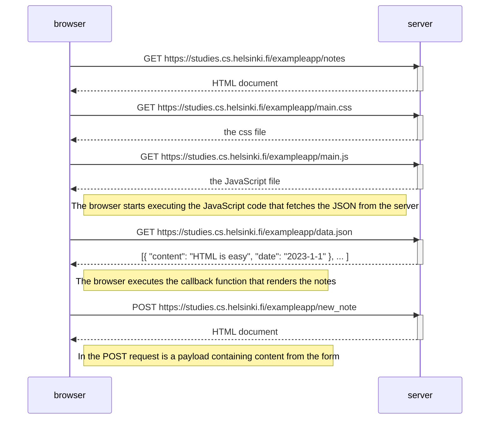
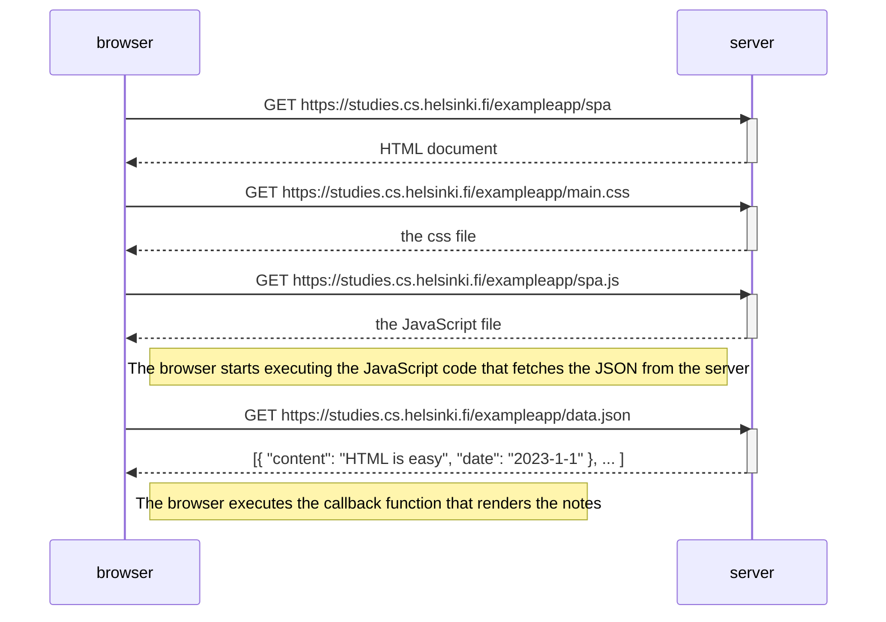
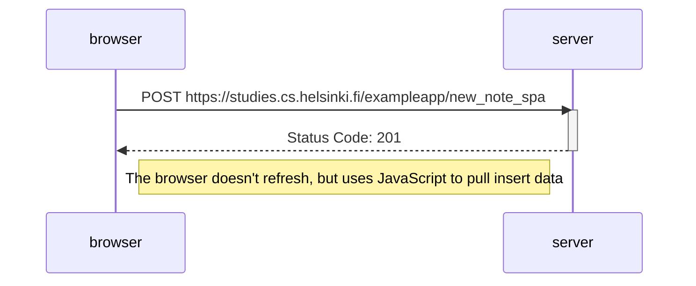

# fullStackOpen
Learning from courses: https://fullstackopen.com/en/

## Part0

### Exercise 0.4

#### Sequence of Events Navigating: https://studies.cs.helsinki.fi/exampleapp/notes

### Exercise 0.5

#### Sequence of Event Navigating: https://studies.cs.helsinki.fi/exampleapp/spa

### Exercise 0.6

#### Sequence of Event Submitting: https://studies.cs.helsinki.fi/exampleapp/spa

    
